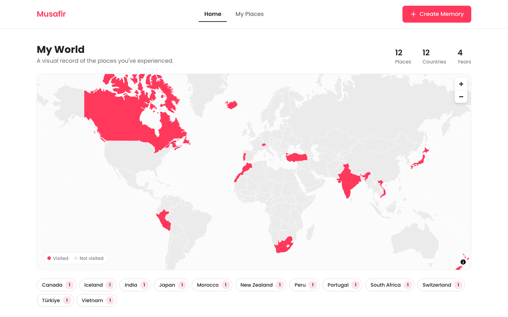
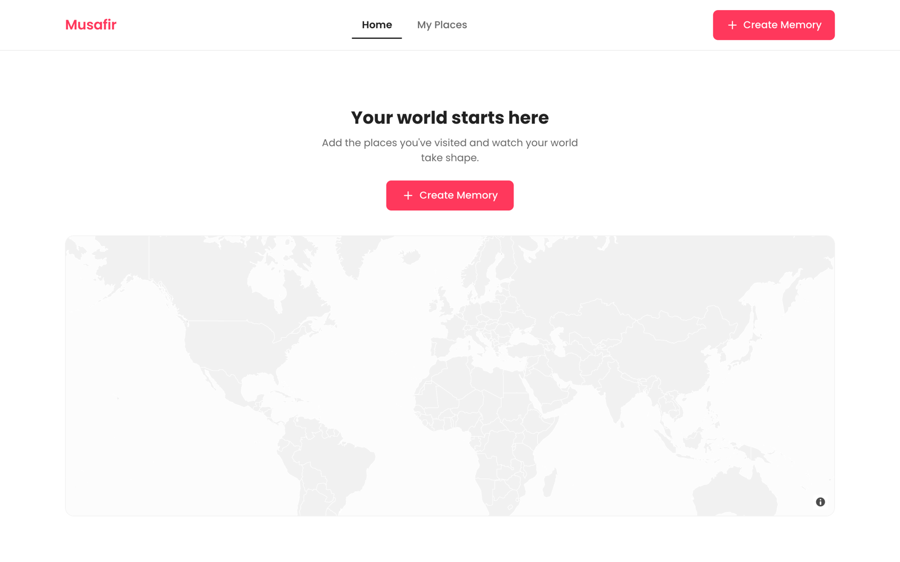
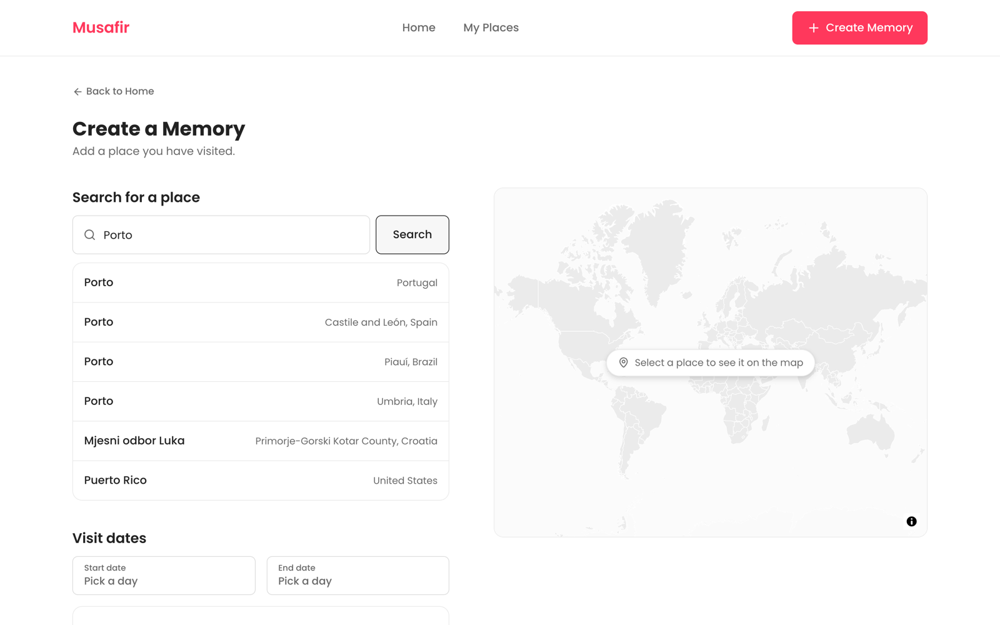
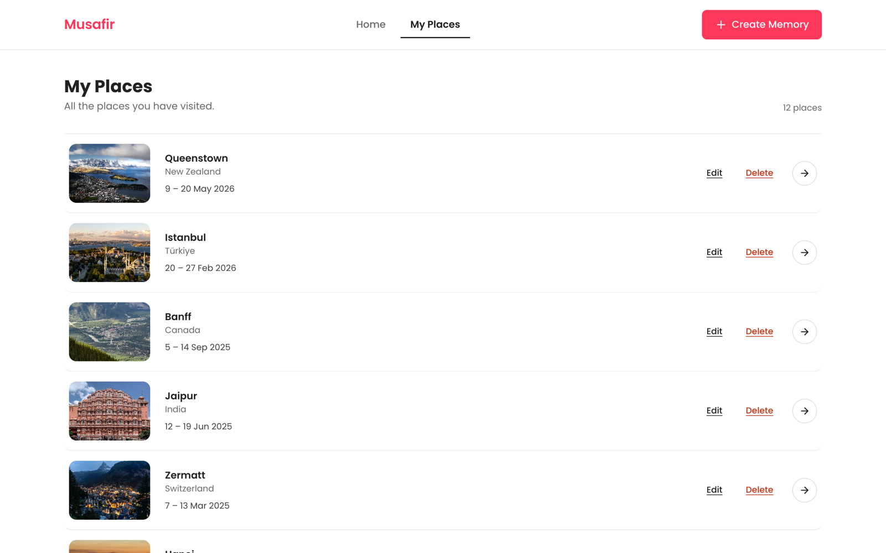
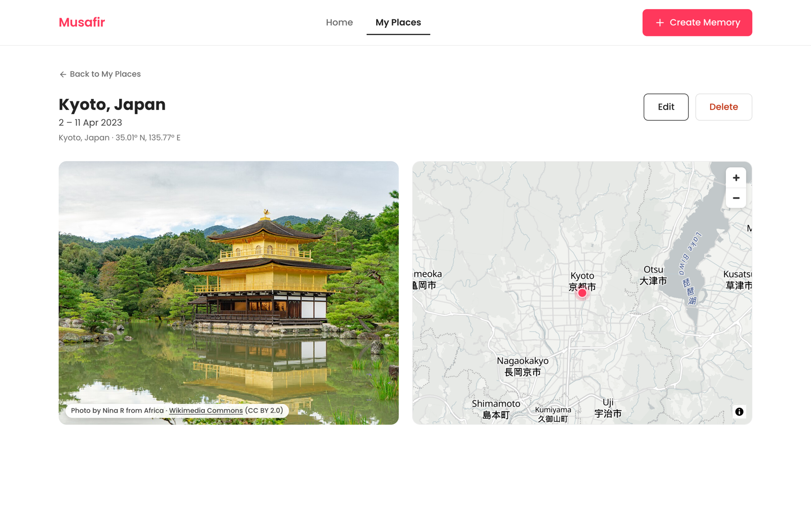

<h1 align="center">Musafir</h1>

<p align="center">
  A personal travel-memory map. Add the places you have visited and watch your world fill in,
  one country at a time.
</p>

<p align="center">
  <a href="#live-demo"><strong>Live demo</strong></a> ·
  <a href="#screenshots">Screenshots</a> ·
  <a href="#how-it-works">How it works</a> ·
  <a href="#run-it-locally">Run it locally</a>
</p>



## Live demo

_TODO: add the deployed URL._

## The idea

> **See the world you have experienced, and revisit the memories connected to those places.**

Musafir is built around one emotional idea: *the more you travel, the more your world fills in.*
You add a place you have already visited — where, when, and one photo — and its country lights up
on your personal world map. The map is the product; as memories accumulate, more of the world
becomes yours.

It stores past travel and nothing else. It is not a trip planner, a booking tool, an itinerary
builder, a future-trip tracker, a social network or an analytics dashboard. Everything that isn't
"a visual record of where you have been" is deliberately out of scope, which is what keeps the one
thing it does feeling calm.

Every app that offered to map my travels wanted an account first, and usually my location history
with it. That felt like a steep price for something I only wanted to look at. So Musafir has no
backend and no sign-in: your places live in your browser, and if you close the tab, nothing about
you has gone anywhere.

## Features

- **A world map that fills in.** Every country you have visited is highlighted, joined to your
  memories by ISO 3166-1 alpha-2 code, with per-country memory counts on hover.
- **Explicit place search.** Search a city, place or landmark and pick from real geocoded results
  (OpenStreetMap Nominatim), so every memory has genuine coordinates and a country.
- **Photos without the work.** One destination photo is resolved automatically from Wikipedia /
  Wikimedia Commons — or Pexels if you supply a key — cached locally and credited per photo.
- **At-a-glance stats.** Places, countries and years visited, all derived from your memories
  rather than stored alongside them.
- **Your data stays yours.** No accounts, no backend, no analytics. Everything lives in your
  browser's `localStorage`.

## Screenshots

| Empty state | Create a memory |
|---|---|
|  |  |

| My Places | Place details |
|---|---|
|  |  |

## Tech stack

**App** — React 19 · TypeScript · Vite 8 · React Router 8 · plain CSS with a design-token layer
(no Tailwind, no CSS-in-JS) · Poppins via Google Fonts · Lucide icons · Radix Tooltip ·
React DayPicker + date-fns · Sonner for toasts.

**State & persistence** — a single Zustand v5 store with the `persist` middleware, writing to
`localStorage` under `musafir.memories`. Photo lookups are cached separately under
`musafir.photos`. There is no server: the browser is the database.

**Map & data** — MapLibre GL JS v6 with OpenFreeMap vector tiles · OpenStreetMap Nominatim for
geocoding · Wikipedia / Wikimedia Commons (default) or Pexels for destination photos · Natural
Earth country polygons, prebuilt at development time from `world-atlas` with `topojson-client`,
`topojson-simplify` and `i18n-iso-countries`.

**Tooling** — oxlint · `tsc -b` with project references · Vite build.

## How it works

### One store, everything else derived

`src/store/memories.ts` holds the only mutable state in the app: an array of memories. Counts,
unique countries, years visited, per-country groupings and sort orders are **computed on read**
in `src/lib/derived.ts`, never stored. That means there is no denormalised state to keep in sync —
adding or deleting a memory updates one array and every number on screen follows.

### Country highlighting without a geo backend

Highlighting a country on a vector map usually means a spatial query. Musafir does it offline
instead. `npm run build:countries` takes Natural Earth data from the `world-atlas` package,
simplifies the topology, tags each feature with its ISO 3166-1 alpha-2 code and emits static
`public/countries.geojson` and `public/country-bounds.json`. Nominatim already returns a
`country_code` for every place you pick, so highlighting is a plain string join against a GeoJSON
source — no PostGIS, no runtime geometry work, and the polygons ship with the app.

### Resolving photos, gracefully

`src/lib/imagery.ts` resolves a single photo per place, preferring Pexels when
`VITE_PEXELS_API_KEY` is set and otherwise falling back to Wikipedia / Wikimedia Commons, which
needs no key. Results are cached in `localStorage`, and a memory saved before its photo resolved
is backfilled on render and written back to the store. Every one of these services can fail — when
they do, the memory still saves and the UI shows a calm placeholder.

### Project layout

```
src/
├── components/   # AppShell, WorldMap, PlaceMap, MemoryForm, DateRangePicker, …
├── pages/        # Home, Create, Edit, My Places, Place Details, Not Found
├── store/        # the persisted Zustand store
├── lib/          # derived values, map setup, countries, geocoding, imagery
└── index.css     # design tokens
scripts/
└── build-countries.mjs   # Natural Earth → countries.geojson + country-bounds.json
```

The specification this was built against, the product decisions and the visual system are
written down in [`docs/PLAN.md`](docs/PLAN.md), [`PRODUCT.md`](PRODUCT.md) and
[`DESIGN.md`](DESIGN.md).

## Run it locally

```sh
npm install
npm run dev
```

Destination photos come from Wikipedia / Wikimedia Commons and need no key or setup. To prefer
[Pexels](https://www.pexels.com/api/) stock photography instead, add a free key:

```sh
cp .env.example .env
# then set VITE_PEXELS_API_KEY=...
```

Without a key, memories save normally and show a calm placeholder instead of a photo.

### Scripts

| Command | What it does |
|---|---|
| `npm run dev` | Start the dev server |
| `npm run build` | Type-check and build to `dist/` |
| `npm run lint` | Run oxlint |
| `npm run build:countries` | Regenerate `public/countries.geojson` and `public/country-bounds.json` |

## Scope

This is Phase 1, and the boundary is intentional: Home, Create/Edit Memory, My Places and Place
Details. No auth, no backend, no trip planning, no timeline, no social features, no filters, notes
or galleries. The map is the product; everything else earns its place or stays out.

## Attribution

Map tiles © [OpenFreeMap](https://openfreemap.org) / © OpenMapTiles · Data from
© OpenStreetMap contributors. Place search by Nominatim. Destination photos from Wikimedia Commons
or Pexels, credited per photo. Country polygons derived from Natural Earth.

Screenshots use sample data, not real trips.

## License

[MIT](LICENSE)
